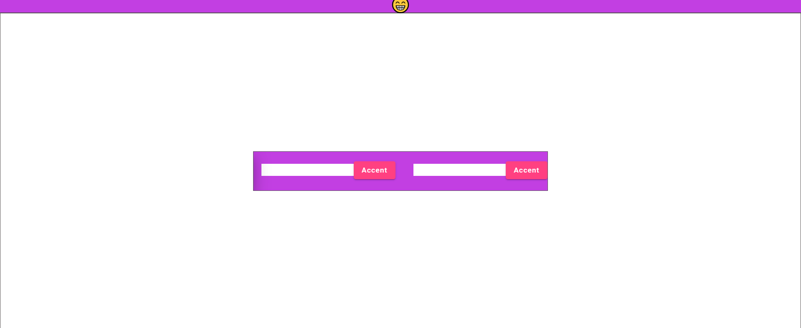
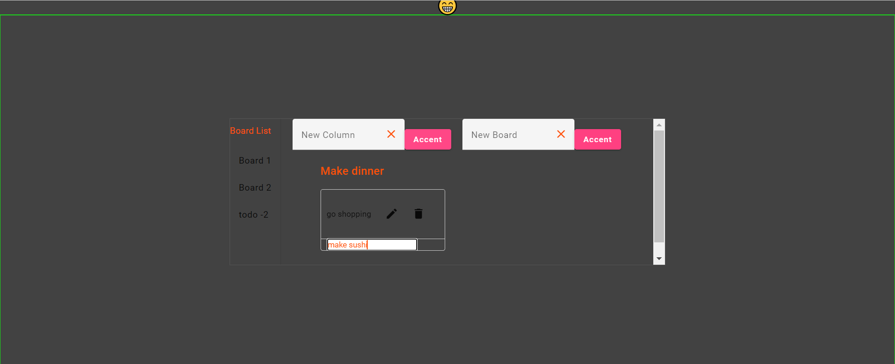

# TO-DO 


- Dark - light theme
- Using local stroge
- Each board will have different todos and they will be kept locally.
## Run on Your Computer

Clone the project

```bash
  git clone https://github.com/elselif/trello_.git
```


Install required packages

```bash
  npm install
```

Run the server

```bash
  ng serve
```


## Screenshot




